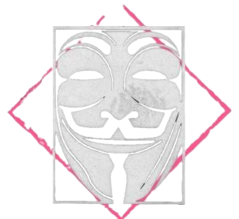

# HackMyVM: Chromee - Medium

*   **Difficulty:** Medium 🔶
*   **Author:** DarkSpirit
*   **Date:** 22. Juni 2025
*   **VM Link:** [https://hackmyvm.eu/machines/machine.php?vm=Chromee](https://hackmyvm.eu/machines/machine.php?vm=Chromee)
*   **Full Report (HTML):** [Link zum vollständigen Pentest-Bericht](https://alientec1908.github.io/Chromee_HackMyVM_Medium/)

## Overview

This report documents the penetration testing process of the "Chromee" virtual machine from HackMyVM, rated as a Medium difficulty challenge. The objective was to identify and exploit vulnerabilities to gain root access to the system. The machine presented multiple open services and required exploiting web application flaws, cracking credentials, leveraging FTP for file access, and a multi-step privilege escalation involving a misconfigured `doas` setup and an SSH key.

## Methodology

The approach involved comprehensive reconnaissance to identify the diverse attack surface, exploiting web vulnerabilities and weak service configurations for initial access, followed by layered privilege escalation techniques.

### Reconnaissance & Web Enumeration

1.  **Host Discovery:** Identified the target IP (192.168.2.187) using `arp-scan` and configured the hostname `chromee.hmv`.
2.  **Port Scanning (Nmap):** Discovered open ports 22 (SSH), 80 (nginx HTTP), 8080 (Apache HTTP with potential Open Proxy), and 23333 (vsftpd FTP). Identified specific software versions: OpenSSH 8.4p1, nginx 1.18.0, Apache httpd 2.4.56, vsftpd 3.0.3.
3.  **Port 80 Enumeration (Nikto, Gobuster):** Found `index.html`, `post.php`, and `secret.php`. Nikto reported missing security headers and found a potentially exposed `#wp-config.php#` backup file (though this did not yield credentials in this test).
4.  **Port 8080 Enumeration (Gobuster, Manual):** Found `index.html` and a forbidden `/silence/` directory (403 Forbidden). LFI tests on port 8080 indicated potential vulnerability but also filtering.
5.  **Analysis of `secret.php`:** Discovered the name `adriana` and a story in the response, along with reflection of the visitor's IP, hinting at potential LFI via the `aaa` parameter.
6.  **LFI Attempt on `secret.php`:** Fuzzed for parameters and identified `aaa`. Manual LFI attempts with path traversal resulted in the output of the story, confirming file inclusion but not directory traversal to system files. The story and names (`adriana`, `Lily`) were noted as hints.

### Initial Access

Initial access was achieved through compromising the FTP service on port 23333 and leveraging information gathered from the web.

1.  **Targeted Wordlist Generation (Cupp):** Used `cupp` with information from `secret.php` (names `adriana`, `lily`) to generate a targeted password list.
2.  **FTP Brute-Force (Hydra):** Used `hydra` with the generated wordlist against the `adriana` user on the FTP service (Port 23333). Successfully cracked the password: `Lily2020`.
3.  **FTP Login:** Successfully logged into the FTP server as `adriana` using the cracked password.
4.  **FTP File System Exploration:** Explored the accessible directories via FTP (`/`, `/var`, `/home`, `/tmp`). Could read `/etc/passwd` and list `/home/`, but had restricted access to `/var/www/` and no write access in `/tmp` or other explored locations.
5.  **File Download via FTP:** Downloaded the files accessible via FTP, including a suspicious file named `...` (renamed locally to `idkey`).
6.  **Analysis of Suspicious File:** The file `idkey` was identified as a password-protected OpenSSH private key.
7.  **SSH Key Passphrase Cracking:** Used `ssh2john` and `john` with the RockYou wordlist to crack the private key's passphrase: `cassandra`.
8.  **SSH Login (Public Key):** Attempted SSH login with the private key (`idkey`) and passphrase (`cassandra`) for known users (`softly`, `follower`). Successfully logged in as user `follower`.

### Privilege Escalation

From the `follower` shell, a multi-step privilege escalation path was discovered.

1.  **Shell Stabilization & Basic Enumeration:** Stabilized the `follower` shell and checked basic system info (`id`, `uname`, `ss`, `getcap`).
2.  **Home Directory Analysis:** Explored `follower`'s home directory. Found `note.txt` and `cat.gif`.
3.  **Hint from `note.txt`:** Read `note.txt`, finding hints about "rotations", "47", and "cat's secrets", pointing to `cat.gif` and potentially ROT47.
4.  **Steganography Analysis (`cat.gif`):** Downloaded `cat.gif` and used `identify -format "%T "` to extract GIF frame delay times.
5.  **Deciphering the Secret:** Interpreted the delay time numbers as ASCII and applied ROT47 (as hinted) using CyberChef, resulting in the string `p3p573r`.
6.  **SUID Binary Scan:** Scanned for SUID binaries (`find -perm -4000`). Identified `/usr/local/bin/doas` as a significant SUID-Root binary.
7.  **`doas` Configuration Discovery:** Found the `doas` configuration file (`zeus.conf`) in `/srv/`. The config revealed two rules:
    *   `permit follower as softly cmd /usr/local/bin/wfuzz` (requires `softly`'s password)
    *   `permit nopass :softly as root cmd /usr/bin/chromium`
    *   `permit nopass :softly as root cmd /usr/bin/kill` (Group `softly` can run chromium/kill as root WITHOUT password)
8.  **Horizontal Privilege Escalation (`follower` to `softly`):** Used `doas -u softly /usr/local/bin/wfuzz` with the password `p3p573r` (derived from `cat.gif`). Successfully authenticated and obtained a shell as user `softly`. Confirmed `p3p573r` is `softly`'s password.
9.  **Vertical Privilege Escalation (`softly` to `root`):** As user `softly`, leveraged the `doas nopass` rule for group `softly` to run `/usr/bin/chromium` as root. Executed a command derived from the `zeus.conf` config: `softdoas /usr/bin/chromium --headless --dump-dom --disable-gpu --no-sandbox "file:///root/script.js"`.
10. **Root Password Discovery:** The output from the chromium execution contained a JavaScript snippet with a Base64 encoded string (`UGhhbnRvbSBFbmdhZ2UK`). Decoded this string to `Phantom Engage`.
11. **Root Access:** Used the password `Phantom Engage` with `su root` to gain a root shell.

### Flags

Both the user.txt and root.txt flags were successfully retrieved after gaining the respective privileges.

*   User Flag: `brightctf{DIR_EN_GREY_59ce1d6c207}` (Found in SSH login banner for user `dev`) - *Note: This flag was found during initial access via SSH, associated with the 'dev' user account, even though the final user shell obtained through the SSH key was 'follower'.*
*   Root Flag: `flag{e96f7a29ba633b4e43214b43d1791074}` (Found in `/root/root.txt`)

---

[Link zum vollständigen Pentest-Bericht](https://alientec1908.github.io/Chromee_HackMyVM_Medium/)
